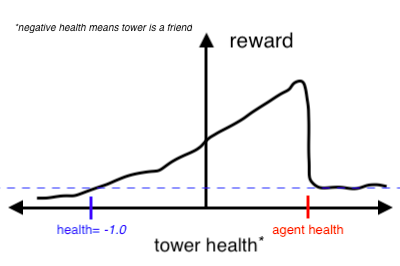

# Solving a Minimal RTS Environment with a deep RL Agent
Sam Greydanus. February 2018. MIT License.

_Written in PyTorch_

About
--------
 * We introduce a simple RTS environment called **"Towers"**
  * Technically, it's a conditional multi-armed bandits environment.
  * Learn about the environment [here](https://nbviewer.jupyter.org/github/greydanus/minirts/blob/master/minirts-env.ipynb)
 * We train a simple agent to solve this environment
  * It's a policy gradient algorithm. I add a value estimator just for kicks :)
  * Learn about the agent [here](https://nbviewer.jupyter.org/github/greydanus/minirts/blob/master/minirts-agent.ipynb)
 * We (sort of) visualize what the agent has learned
  * We use a perturbation-based saliency approach.
  * Learn about the perturbation and look at results [here](https://github.com/greydanus/minirts/blob/master/minirts-saliency.ipynb)
  
RTS tower setup
--------
More on this in the `minirts-saliency` notebook:

Each tower is positioned randomly in its quadrant. Each quadrant is a 5x5 pixel square. The agent always gets placed in the center of the RTS space...which ends up being pixel (5,5) in the 10x10 pixel gamespace.

Reward landscape
--------
More on this in the `minirts-saliency` notebook:

  
Dependencies
--------
* All code is written in Python 3.6. You will need:
 * NumPy
 * Matplotlib
 * [PyTorch 0.3](http://pytorch.org/): easier to write and debug than TensorFlow :)
 * [Jupyter](https://jupyter.org/)
